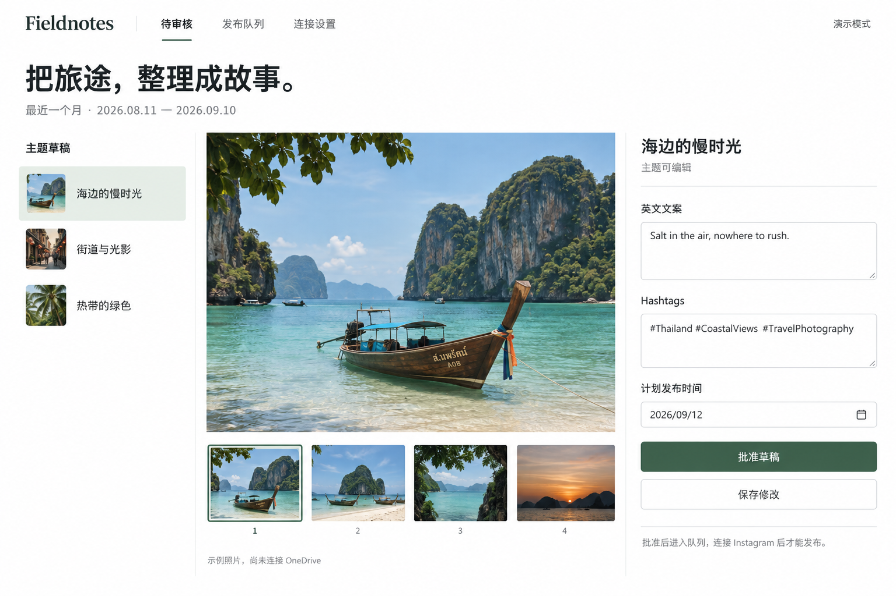

# PhotoStory

[简体中文](README.zh-CN.md)

An open-source, private photo editorial desk by **Pigbibi**, licensed under **MIT**.
Turn OneDrive camera backups into landscape photo drafts with English captions
and hashtags, then review each post in a Cloudflare-hosted website.

**v0.1 is a review application, not an Instagram publisher.** There is no publishing
endpoint, Instagram token, scheduled posting, or automatic approval in this version.
The public demo uses one clearly labelled AI-generated image; no personal photos
or live model results are included in this repository.



## How it works

1. Sign in with an explicitly allowed GitHub account.
2. Authorize OneDrive through Microsoft's official consent page (`Files.Read`,
   `offline_access`). Originals are never modified or deleted.
3. Choose a folder and a bounded capture-date range, including nested year/month
   folders. Request a batch in the website.
4. Run the batch processor on your trusted VPS, using your own existing AIGateway
   installation. It claims one job, obtains a short-lived Graph access token from
   the private backend, reads previews, and asks Codex to screen them.
5. Only explicitly allowed landscape photos with no privacy flags and aesthetic
   score >= 7 enter the composition pass. Codex proposes up to three drafts, each
   with 1–8 photos, an English caption and 3–5 suggested English hashtags.
6. Review, edit, reorder, remove, save, approve, or return a draft. Editing approved
   content revokes that approval. Approval conflicts across tabs are rejected.

The UI is Chinese; generated posting text is English. The app's display brand is
Fieldnotes; the software project is PhotoStory. The configured date interval uses
Asia/Shanghai and an exclusive end date. Capture timestamps must include a timezone;
missing capture time is skipped rather than replaced with upload time.

## Requirements

- Node.js 22.12+ and npm; Cloudflare Workers + D1; a GitHub account.
- Your own GitHub OAuth App and Microsoft Entra application registration supporting
  personal Microsoft accounts. Cloudflare secrets are configured server-side.
- Python 3.11+, Pillow, and a trusted, authenticated Codex installation exposed
  through AIGateway's `bin/codex-gateway` CLI contract.

The web app uses React/Vite; its Worker uses standard Web APIs with no server
framework. Python uses the standard library plus Pillow to normalize previews,
apply orientation and strip EXIF metadata. There is no paid model API dependency.
Cloudflare usage and Codex limits still depend on your own account plans.

## Deploy your own

```sh
npm ci
npm test
python3 -m unittest discover -s tests -p 'test_*.py'
npm run build
cp wrangler.jsonc wrangler.local.jsonc
npx wrangler d1 create photostory
```

Edit `wrangler.local.jsonc`: choose a unique Worker/database name, replace the D1
database ID, and set `ALLOWED_GITHUB_USERS` to your exact GitHub username. This
local configuration is ignored by Git. Never widen the allowlist to `*`.

```sh
npx wrangler d1 execute photostory --remote --file worker/schema.sql --config wrangler.local.jsonc
npx wrangler deploy --config wrangler.local.jsonc
```

The public shell and demo are available immediately. Private data endpoints deny
unauthenticated access, and OAuth stays disabled until fully configured.

### GitHub sign-in

Create a dedicated OAuth App in [GitHub developer settings](https://github.com/settings/developers):

- Homepage: your deployed site's HTTPS origin.
- Callback: `https://YOUR-SITE/auth/github/callback`.
- No repository write scope is requested. Identity is checked against the server's
  exact GitHub username allowlist.

Set secrets with the interactive Cloudflare prompt (never paste secrets in chat):

```sh
npx wrangler secret put GITHUB_CLIENT_ID --config wrangler.local.jsonc
npx wrangler secret put GITHUB_CLIENT_SECRET --config wrangler.local.jsonc
```

GitHub login credentials from another app are not reused: its callback registration
belongs to that other app. We follow the invoice portal's server-side OAuth/session
pattern with separate credentials, cookies, and database storage.

### OneDrive authorization

In [Microsoft Entra](https://entra.microsoft.com/), register an application supporting
personal Microsoft accounts. Add a **Web** redirect URI:
`https://YOUR-SITE/auth/microsoft/callback`. Create a client secret and configure:

```sh
npx wrangler secret put MICROSOFT_CLIENT_ID --config wrangler.local.jsonc
npx wrangler secret put MICROSOFT_CLIENT_SECRET --config wrangler.local.jsonc
```

Generate a cryptographically random 32-byte key, base64-encode it, and place it in
`TOKEN_ENCRYPTION_KEY` using the same secret prompt. The Worker encrypts Microsoft
refresh/access tokens with AES-GCM before storing them in D1. Preserve this key
securely; changing it requires reconnecting OneDrive. Then sign in to PhotoStory,
open **连接设置**, and click **连接 OneDrive** to complete Microsoft's consent.

`Files.Read` is an account-level delegated read permission. Folder selection is
enforced by the scanner, not a Microsoft folder-scoped OAuth grant. The application
recurses only under the selected root, skips remote shortcuts and screenshot
filenames, and applies capture-date bounds. Review previews contain no EXIF/GPS.

### Connect your existing Codex VPS

This project does not ship or access Pigbibi's private AIGateway service. Deployers
must provide their own gateway. The adapter consumes this existing CLI contract:
`--prompt-file`, repeated `--image`, `--output-schema`, `--out`, `--providers codex`,
`--sandbox read-only`, `--ask-for-approval never`, `--cwd`, and bounded timeout.

On the trusted VPS, install the small Python dependency in a virtual environment:

```sh
python3 -m venv .venv
.venv/bin/pip install -r scripts/requirements.txt
```

Generate a separate random machine secret of at least 32 bytes. Store the same
value in Cloudflare's `BATCH_TOKEN` and in a permission-0600 VPS environment file
as `PHOTOSTORY_BATCH_TOKEN`. The VPS environment also needs:

```text
PHOTOSTORY_URL=https://YOUR-SITE
CODEX_GATEWAY_COMMAND=/path/to/your/aigateway/bin/codex-gateway
CODEX_GATEWAY_BACKEND=local
```

Do not commit that file. Load it through your process manager's `EnvironmentFile`
or another restricted environment mechanism. Then run:

```sh
.venv/bin/python scripts/process_batch.py
```

One invocation claims at most one queued job. No timer, scheduler, daemon, or remote
configuration change is installed automatically. When using AIGateway's `service`
backend instead, its existing GitHub Actions OIDC repository/workflow/ref allowlists
and HTTPS requirements still apply; never disable those protections. A private
GitHub Action may not be callable from public repositories; the documented VPS CLI
path avoids depending on access to a private action from this public project.

## Privacy and selection policy

The policy is in `scripts/process_batch.py` (`SCREEN_PROMPT`, `GROUP_PROMPT`).
See [privacy and limits](docs/privacy.md) before supplying real photos.

- Safety is checked before aesthetics and grouping; uncertain, missing and invalid
  decisions never become drafts. Unknown/duplicate photo IDs are rejected.
- Models can still make mistakes. A score is not proof of safety or objective
  beauty. Inspect every real preview and caption before approving.
- Previews must reach Codex to be screened. Sensitive source images may therefore
  be processed by your configured Codex path even when later excluded. This is not
  an on-device privacy filter and does not change Codex's service data policies.
- Only selected safe previews and drafts enter private D1 storage. No private
  data is stored in the repository, public assets, GitHub artifacts or browser
  localStorage. The public generated demo never enters the real draft backend.
- Batch processor logs only generic status/counts. Rejected previews are removed
  from its private temporary directory; all temporary input/output is removed when
  the process exits normally. No cross-provider fallback is allowed.
- First batches default to at most 100 eligible photos (hard ceiling 300), with
  bounded folder/page traversal. Exceeding the budget fails the whole batch; narrow
  the date range instead of silently claiming complete coverage.

## Validation and current release limits

Run `npm test`, the Python unittest command above, and `npm run build`.
Node tests cover private-route protection, exact allowlisting, CSRF, OAuth state,
token encryption, and review/approval transitions. Python tests cover privacy
gates, allowed photo references, timestamp handling and token origin boundaries.

Real GitHub OAuth, Microsoft consent/refresh, your actual folder format, Codex
visual results and VPS operation require your deployment configuration and an
explicit live run. Unit tests and the demo do not verify those integrations.
Instagram scheduling/publishing is intentionally not implemented in v0.1.

## License

[MIT](LICENSE), copyright 2026 Pigbibi. Deploy your own instance with your own
accounts, keys and service permissions.
